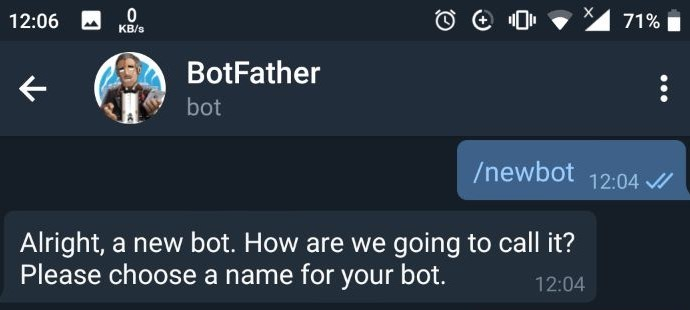
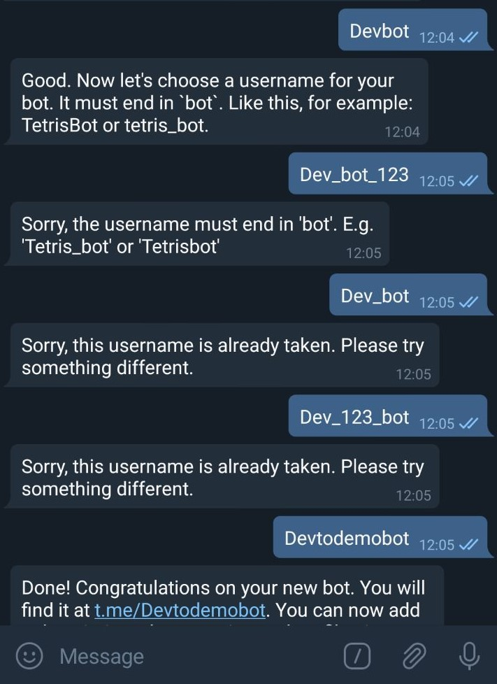
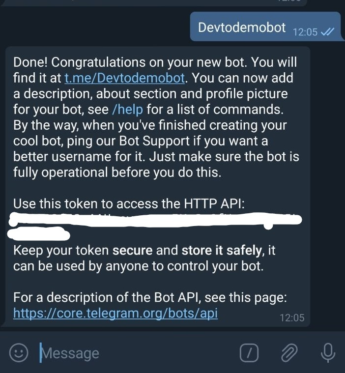
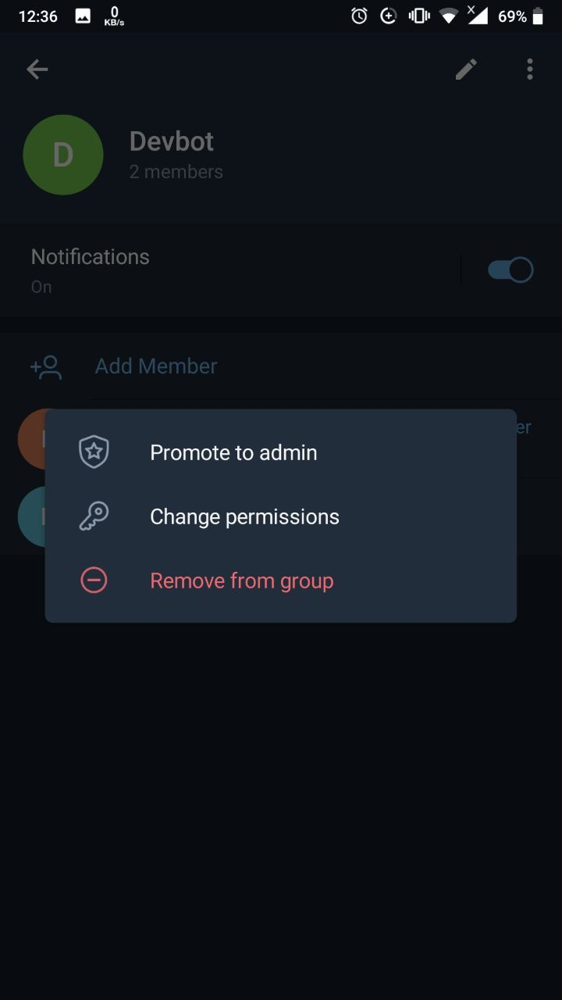
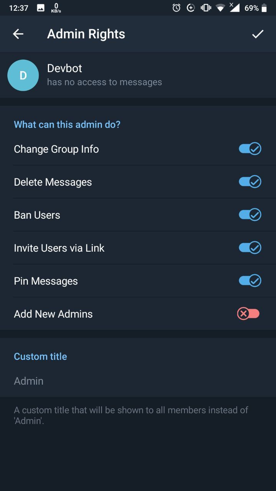
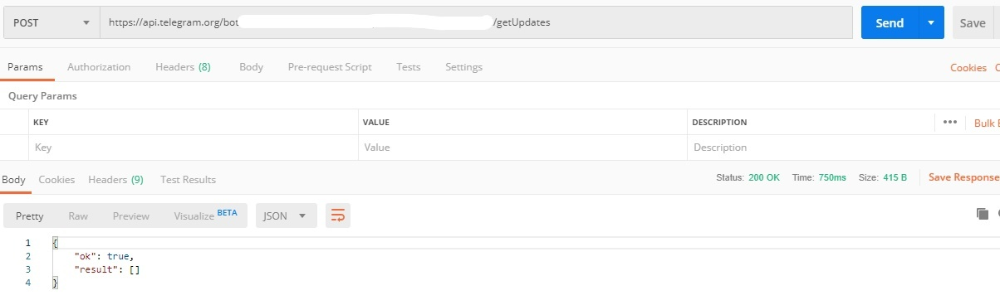
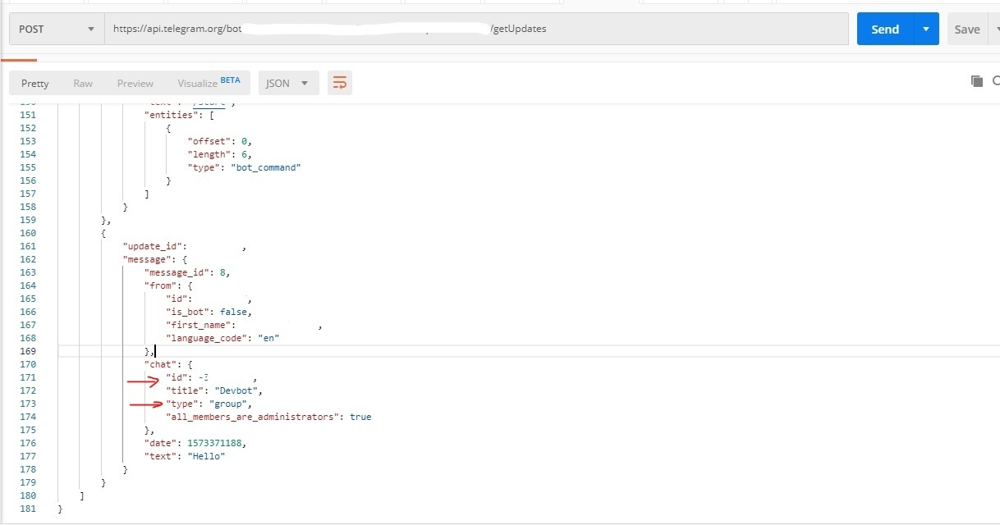
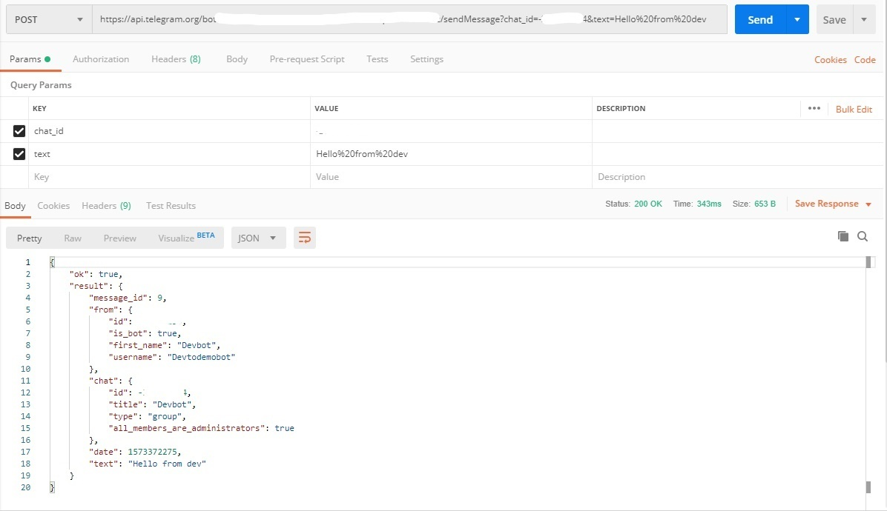
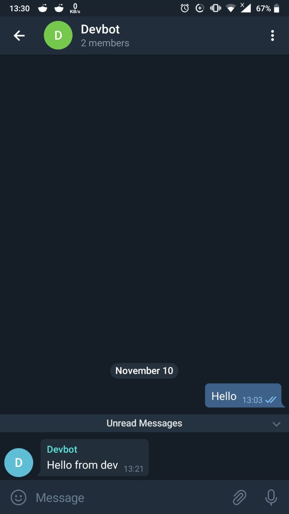

## Hi everyone,

____

In this tutorial, we’re going to build a telegram bot ,and send messages to a group with a simple HTTP request.

to get start lets create a new telegram bot with, it's own API Botfather.

#### One Bot To Rule Them All

so go to telegram app on your phone, or log in with [telegram web](https://web.telegram.im/#/login)

and then search for bot father.
create a new bot `/newbot`

____

____

now follow along with instructions.

type a name for your bot
I had a hard time finding a username 😆

____

____

now you'll get a token to authenticate with your bot.

____

____

 keep the access token securely. Anyone with access token can manipulate your bot

alright, now we have the access token. The next question is how to send messages with the bot.

____

#### we will create a group with our bot. And then our bot will massage to that group

it's simple as that😎

now let's create a new group in telegram and add the bot to that group.

search with the username of your bot

add our bot to the group

____

after adding give admin permission to our bot, to give access to the bot to send messages to the group (not all the permissions are necessary but I will give because this is a demo group and nothing harmful will happen ).
____

now everything is set in this end.

The next thing we need is to get our group chat id to send messages to the group.

to get it we need to interact with the telegram API.

i hope yall have postman📬 ready. if not you can download [postman](https://www.getpostman.com/) , since it is a useful tool in web dev.
or alternatively, you can use [postwoman](https://postwoman.io/) which is a great way to build requests online.

before we sending requests, make sure to send some messages to our newly created group.

after that let's fire up postman

send a `POST` request to the following telegram API endpoint.

replace <token> with your access token we previously got from bot father

`https://api.telegram.org/bot<token>/getUpdates`

and Send.

if you get something like this, try few more times. I don't know the exact cause, but it sometimes returns empty arrays.(make sure you have some messages in the group)

____

____

hopefully, you'll receive something similar to this.

____

____

from here what we want is the chat id that starts with `-`

this is the group chat id of our group.

after that, the only thing left is to send messages.

so to send messages to our group.

use the following API endpoint

`https://api.telegram.org/bot<token>/sendMessage?chat_id=<group chat id >&text=<our text>`

keep in mind that text should be URL Encoding String

ex - Hello%20World (spaces is replaced with %20)

checkout [w3school](https://www.w3schools.com/tags/ref_urlencode.asp) for more info

____

____

and `wubba lubba dub dub` your message is sent

____

____

#### This is a great way to monitor and notify your apps state. I use this for the backend of my web apps to report errors. you can also use it with frontends, CLI applications regardless of the language. you can use this creatively to do many things because this needs no 3rd party libraries or dependencies, just a simple HTTP request will do the work.

____

### Thanks for following along with me 🙌

## what are your plans ? 💭

## share them in the comments section.

## I'd love to hear your feedback!

### originaly posted on [Dev.to](https://dev.to/rizkyrajitha/get-notifications-with-telegram-bot-537l)
