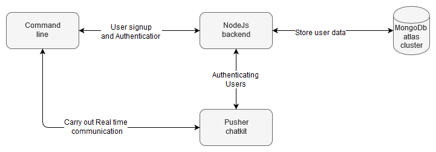

## Hello everyone,

I recently started developing a command line chat application . This idea was floating with me for quite sometime , i actually made a prototype few months ago , but it was for proof of concept kind of thing. So i recently build it with more features and little more tidy 😂 .
_____

### What exactly i build 
_____

_____

 well , 
[Aloha-cli-chat](https://www.npmjs.com/package/aloha-cli-chat) is a real time command line chat application build with Nodejs. So this is a chat application , but it runs on your command line!.

for sometime i was goofing around with pusher services for my University second year project, and i came across with [pusher chatkit](https://pusher.com/chatkit) service. It is a awesome out of the box real time chat service you can integrate with many different environments. So i wanted to test it out. I could have implemented a node react web app to test , but it was very common. I wanted to do something different. so with some research i decided to build a command line chat application, it was easy to start with, and matched with my NodeJs skill set .
 
____

### How i made it
____

Aloha-cli-chat's command line interface and backend server both are build with NodeJs. I used Mongodb for storing user data.but most hard part is done by pusher chatkit.

To get a better understanding, i'll break down the process.

First a new user can signup to our chat application via command line.

After signing up a our system will create a new pusher chatkit user on behalf of that user , and we can authenticate this user with our system (from credentials we collected) .

in a successful authentication , our system will issue a `auth token` from pusher and send it to the client , so client can start chatting , creating chat rooms etc.

____

### What i learned by building this 
____

well ,
I learned how to publish a npm package .
How to get data from the command line.
A better understanding about pusher chatkit service, and how i can integrate it in my future projects.

Although this is not ideal for common day-today use, this is a great beginner friendly project as a beginner myself, i learned a great deal from this project.  you'll find many things to improve, and more creative features to add. So i decided to make this a open source project so everyone can join with me to build a better , robust CLI chat application.
PRs and issues are welcome .

[git repo](https://github.com/RizkyRajitha/alohacli)

 Thanks for Reading 🙌

 what are your plans ? 💭

 share them in the comments section.

 I'd love to hear your feedback!
