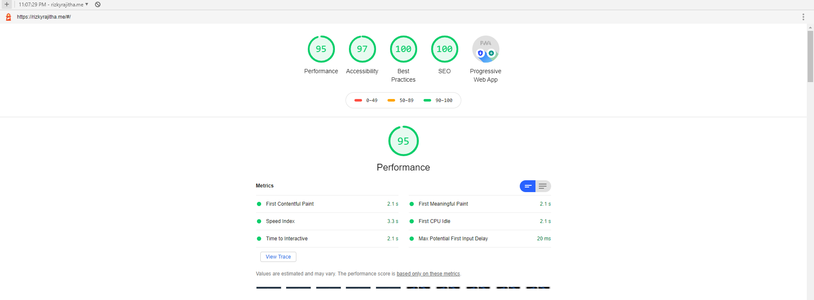

## Hi everyone ,

____

Recently I did some optimizations to this blog, so here i'll talk about them.
first, I changed the background of the landing page to NASA's [Astronomy Picture of the Day](https://apod.nasa.gov/apod/astropix.html) . and it turns out cool. most of the time it gives images but sometimes it post videos, so in that case, I show a previous good one.  
so everything worked great in development, but after deploying, it took ages to show the background image because those images were huge. but looks cool 😎.
so to fix it I did some digging and found out [ImageKit](https://imagekit.io/) , a CDN service that optimizes images for web. they had soo many cool features, but one that suits me was optimizing images from a URL which is the one I've been looking for.
so with it I get compressed images with a decent quality that had a better balance of both size and details of the picture . and it worked great making a significant difference . after that I used it to other images in the portfolio.  
next, I started messing up with unnecessary jquery files that came with bootstrap. after removing jquery navbar toggler didn't work in mobile . and to fix it I used react-bootstrap .
  
finally, I manage to get rid of the huge font awesome CSS asset and replace that with a custom font, with only icons that I used.
[IcoMoon App](https://icomoon.io/app/#/select) allows us to create a custom font with the icons of our choice . and after that, we can add that custom icon pack to our project.
  
after all these optimizations, I got 30% faster loading speeds, it is not the best but it was an improvement 
 
here are the scores of lighthouse

  

  

## Thanks for reading folks see y'all in next one 🙌.
