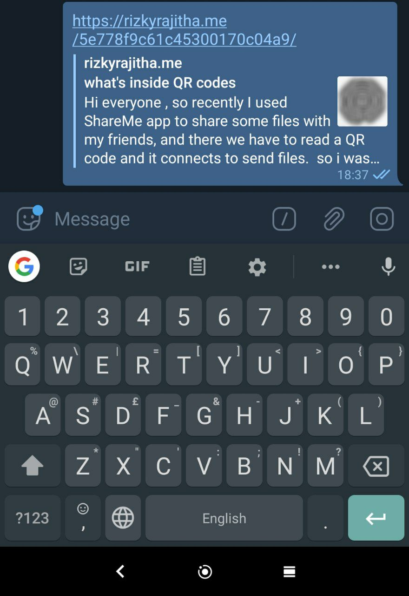

## Hi everyone ,

____

I saw [Gatsby](https://www.gatsbyjs.org/) quite some time ago and I was blown out by it's speed. So I decided to move my blog to Gatsby and here's how I did it. 

My first challenge was to grasp the concepts of Gatsby, and it's SSR stuff. After that, I managed to duplicate the UI from my old blog, nothing fancy there.

But the tricky part was how to manage data. previously i just rendered markdown in clientside via blog API.
now I create pages(blog posts) programmatically from gatsby `createPage` API to render markdown, but all the comments and views will be dynamically rendered on the client-side. and that was working well. now every blog post has it's own HTML file, and because of that SEO is also enhanced. 

Now when I share Blog post URL it will show something similar.

after finishing up all the development work. I started working on a deployment workflow. Earlier i manually build and push build files to [Github pages](https://pages.github.com/). but with Gatsby modifications , it was not very practical since I need to build it every day because  Blog's landing page background is NASA's [Astronomy Picture of the Day](https://apod.nasa.gov/apod/astropix.html) and that was updated every day. so I used Github actions for deployment.

It eased the workflow quite a lot since now everything is built and published by one push to GitHub .  And also a `cron` job ensures the building site every day to keep up with the NASA image.

[Blog Repo](https://github.com/RizkyRajitha/RizkyRajitha.github.io)

## Thanks for reading folks see y'all in next one 🙌.
