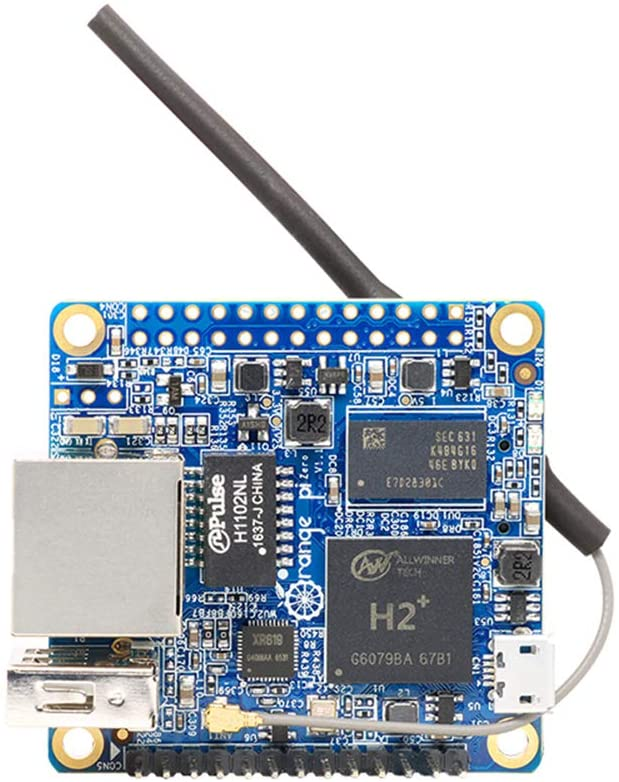
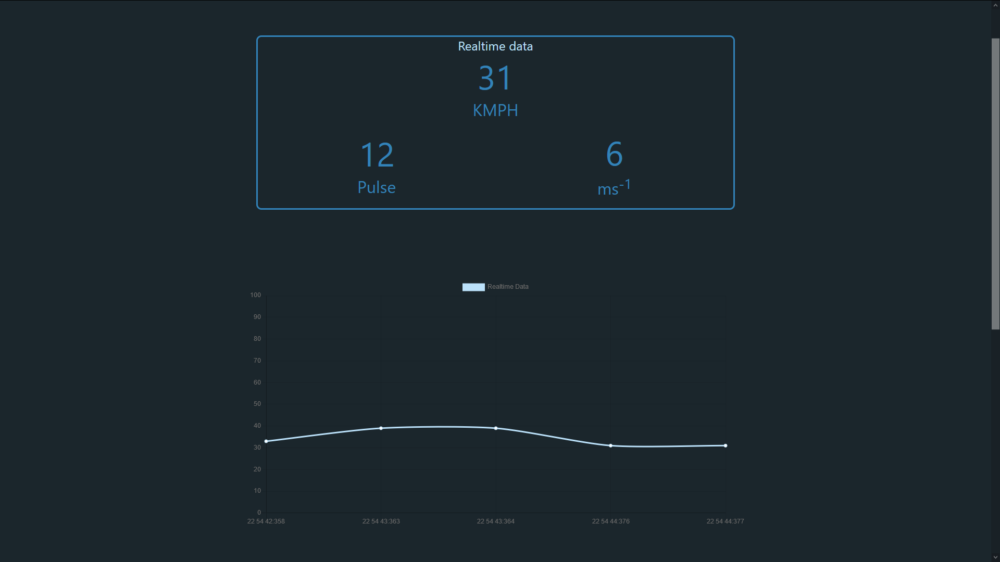

## Hello everyone,

Hope yall are doing well, and safe with this pandemic situation. 
Recently I started making an anemometer just for fun and, got an idea for creating a real-time wind speed dashboard.

for this project, I used [mqtt](https://mqtt.org/) protocol for real-time communication with the client and from the sensor. mqtt is really fast and also reliable and also use low bandwidth. Which is the main reason it is widely used in IoT applications.

here we have 3 main parts

1. wind speed detector developed with and nodemcu
2. node API that handles historical data for the graph
3. react web application to show real-time data and also historical data of the wind speeds

wind speed is detected from an [optical encoder](https://en.wikipedia.org/wiki/Rotary_encoder#Optical_absolute_encoders) that counts how many turns the wind cups are turned within a given time. nothing fancy there.

and when coming to wind speed data, I only collected average and also max wind speeds within an hour and write that data to the database. from this data historical data graphs are created for the last day, last week, and you guessed it last month XD

and that's pretty much it. most of the software is done now. only need a bit of polishing. but hardware is needed to be weatherproofed for actual uses

after developing the API I chose to deploy it on a local running [orange pi](http://www.orangepi.org/orangepizero/). orange pi is a budget alternative for well-known [raspberry pi](https://www.raspberrypi.org/). orangepi is an opensource and developed china based company. it is pretty good for a small project like this.

orange pi  zero

my version is packed with H2 Quad-core processor and 512 Mb of ram, but not all of that is useful since it is shared with GPU after what useable ram is around 400mb. this version includes an ethernet port that supports [PEO](https://en.wikipedia.org/wiki/Power_over_Ethernet) , so that's a good point is IoT based projects, but I used separate DC input to power this. orangepi runs ubuntu based operating system just like the raspberry pi.

when deploying I used [docker compose](https://docs.docker.com/compose/) , but ultimately failed because this version doesn't support it, so I had to do the docker networking part manually, to establish connections between server container and database container. and also this version had some trouble deploying [prisma](https://www.prisma.io/) and [nextjs](https://nextjs.org/) which was my original core libraries for ORM and frontend developing respectively. but both of them failed

1. Prisma needs a dependency with OpenSSL for communicating with the database to generate prima client, but orangepi version was not compatible with that, so I had to use vanilla pg to handle all database stuff. not terrible since there weren't any complex queries, just a few selects and one insert . that all.

2. nextjs shipped with [sharp](https://sharp.pixelplumbing.com/) which is a great image processing library . but the sad thing is that it sharp is based on [libvips](https://libvips.github.io/libvips/) . and guess what it needed a higher version of [glibc](https://www.gnu.org/software/libc/) to get working.so i tried [react](https://reactjs.org/) instead. it was working finally, but I could build react app on orange pi because it's ram limitations, fo every time I need to build in I have to build it in my machine and then copy it to orange pi . which is a bit annoying.

anyway, after these changes everything was working as expected. Below is an image of the dashboard. values are random since I didn't fix the anemometer yet.

anemoneter dashboard (mock values)

Thanks for reading so far. 
Stay safe folks 🙌

