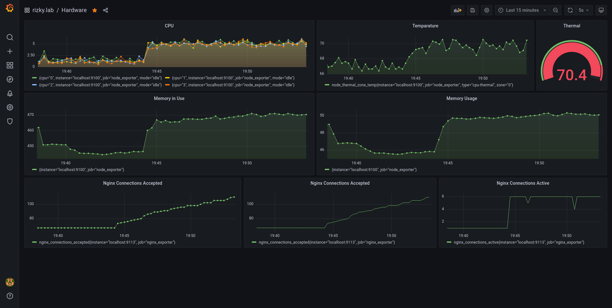

## Hi everyone ,

---

<span style="font-size:1.28rem;">

Hope yall are doing well,
if you have been keeping up with my posts you know that I have an orange pi that is sitting down.
I recently started doing some configuration management and infrastructure as code stuff with ansible and terraform.
so I decided to spin Prometheus and grafana to monitor orange pi. I didn't use Ansible for setting up this in orange pi, because I didn't have any idea whether it was supported or not in that arm7 platform but it turned out to be working really well. so in this post, I will walk through my journey on setting orange pi monitoring with Prometheus and grafana.

so I get started with updating the orange pi.

```bash
sudo apt-get update
```

I first installed downloaded the Prometheus from their [github](https://github.com/prometheus/prometheus/releases/tag/v2.28.1) release. because my orangepi is base on arm7 architecture I downloaded the respective archive. here `-OL` in the curl will redirect if need and save the output file.

```bash
curl -OL https://github.com/prometheus/prometheus/releases/download/v2.28.1/prometheus-2.28.1.linux-armv7.tar.gz
```

after downloading the image extract it to a folder.

```bash
tar -xzvf prometheus-2.29.0-rc.0.linux-armv7.tar.gz prometheus-2.29.0-rc.0.linux-armv7/

```

next, I copied the Prometheus binary to the `/usr/local/bin/` because that I generally where your binary files live in.

```bash
cd prometheus-2.29.0-rc.0.linux-armv7/
cp prometheus /usr/local/bin/
```

after all that was set up, I created a service file for systemd to configure Prometheus as a service in `/etc/systemd/system/`.
this directory is where we write systemd unit files. there are many places among this one but this I a conventional directory that is best suited in this scenario.

`sudo nano /etc/systemd/system/prometheus.service`

```unit
[Unit]
Description=Prometheus monitoring
Wants=network-online.target
After=network-online.target

[Service]
Type=simple
ExecStart=/usr/local/bin/prometheus \
                    --config.file /home/batman/prometheus/prometheus.yml \
                    --web.route-prefix=/ \
                    --web.external-url=http://rizky.lab/prometheus
Restart=always

[Install]
WantedBy=multi-user.target
```

in this file, I have added the `ExecStart` path to the Prometheus binary. here I also added some more arguments to configure Prometheus, because I want to run Prometheus behind an Nginx reverse proxy. and also added the config file in path `/home/batman/prometheus/prometheus.yml` so make sure you have the default `prometheus.yml` (comes with the `tar` archive) file in the specified path.

after that is done. I restarted the systemd daemon and then enable the service.
enabling service will make sure that this service will run after a reboot. it might do many other things behind the back but I notice this when I used this service without enabling it.
next stared Prometheus.

```bash
sudo systemctl daemon-reload
sudo systemctl enable prometheus
sudo systemctl restart prometheus
sudo systemctl status prometheus

```

next, we can start installing the [node_exporter](https://github.com/prometheus/node_exporter/releases/tag/v1.2.0) for orange pi
here also, I looked the same way, searched for the `armv7` architecture binary.
just as before download extract and copy it to the `/usr/local/bin/` directory.

```bash
curl -OL https://github.com/prometheus/node_exporter/releases/download/v1.2.0/node_exporter-1.2.0.linux-armv7.tar.gz
tar -xzvf node_exporter-1.2.0.linux-armv7.tar.gz node_exporter-1.2.0.linux-armv7/
cd node_exporter-1.2.0.linux-armv7/
sudo cp node_exporter  /usr/local/bin/

```

next, I repeated the same steps for creating the unit file for systemd.

`sudo nano /etc/systemd/system/nodeexporter.service`

```unit
[Unit]
Description=node exporter for node monitoring
Wants=network-online.target
After=network-online.target

[Service]
Type=simple
ExecStart=/usr/local/bin/node_exporter
Restart=always

[Install]
WantedBy=multi-user.target

```

after setting up the node_exporter , reload systemd daemon and restarted node_exporter.
keep in mind the service will name after the name of the service file. here node_exporter service will be recognized as nodeexporter because I named the unit file `nodeexporter.service`

```bash
sudo systemctl daemon-reload
sudo systemctl enable nodeexporter
sudo systemctl restart nodeexporter
sudo systemctl status nodeexporter

```

now that we have all in place, next add this nodeexporter to Prometheus as a target. to do that we need to edit the
`prometheus.yml` file we specified earlier. I appended the following to the `prometheus.yml`.

```yml
- job_name: "node_exporter"

  static_configs:
    - targets: ["localhost:9100"]
```

after that restart, Prometheus to catch up with new changes. you can see the change at this point if you visit Prometheus via its opened port.

after that, I set up [Grafana](grafana.com/) for the monitoring dashboard.

For Grafana, it's a bit different than the last approach, hence it could be installed with apt.
I pretty much followed they're [offcial documentation](https://grafana.com/docs/grafana/latest/installation/debian/)

```bash
wget -q -O - https://packages.grafana.com/gpg.key | sudo apt-key add -
echo "deb https://packages.grafana.com/oss/deb stable main" | sudo tee -a /etc/apt/sources.list.d/grafana.list
sudo apt-get update
sudo apt-get install -y grafana

```

```bash
sudo systemctl demon-reload
sudo systemctl enable grafana-server
sudo systemctl start grafana-server
systemctl status grafana-server

```

hereafter setting up everything I need to alter come configurations in the `grafana.ini` file to allow Grafana to access behind a reverse proxy.
this Grafana file lives in `/etc/grafana` directory by default.

in that configuration we have to set `domain` , `root_url` and `serve_from_sub_path` options.

```ini
[server]
# The public facing domain name used to access grafana from a browser
domain = rizky.lab

# The full public facing url you use in browser, used for redirects and emails
# If you use reverse proxy and sub path specify full url (with sub path)
# ;root_url = %(protocol)s://%(domain)s:%(http_port)s/
root_url = %(protocol)s://%(domain)s:%(http_port)s/grafana/

# Serve Grafana from subpath specified in `root_url` setting. By default it is set to `false` for compatibility reasons.
serve_from_sub_path = true

```

after setting this up, restart Grafana to pick up with the latest changes.

now as the last step configure the Nginx as the reverse proxy to access our all mighty Grafana dashboard.

here I previously configured a site as `rizky.lab` , so I am editing that to suit the needs, but you can try any way you like.

```conf
server {
  listen 80 default_server;
  listen [::]:80 default_server;

  root /var/www/rizky.lab;

  index index.html;

  server_name rizky.lab;

         location /prometheus/ {
                proxy_pass http://localhost:9090/;
        }


        location /grafana/ {
                proxy_pass http://localhost:3000/;
        }

        location / {

                try_files $uri $uri/ =404;
        }

        # Proxy Grafana Live WebSocket connections.
        location /grafana/api/live {
                proxy_http_version 1.1;
                proxy_set_header Upgrade $http_upgrade;
                proxy_set_header Connection "Upgrade";
                proxy_set_header Host $http_host;
                proxy_pass http://localhost:3000/;
        }

}

```

and after all that, we can access the all mighty Grafana Dashboard, and configure it as you wish.

---



---

### And with that I am over and out ✌

### If you got any problemo shoot me in the comments sections 🔫

### Cheers 🥂

</span>
