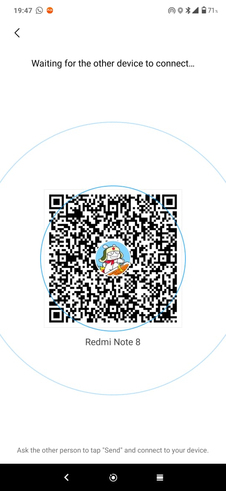
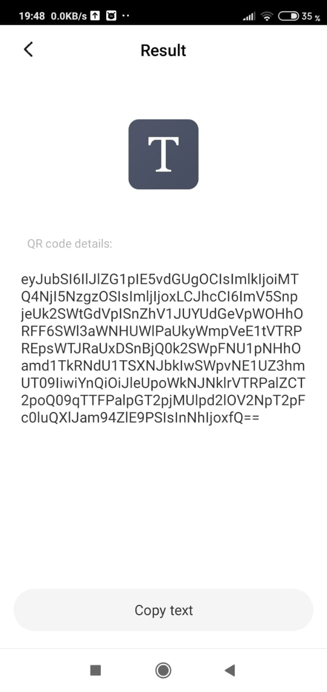
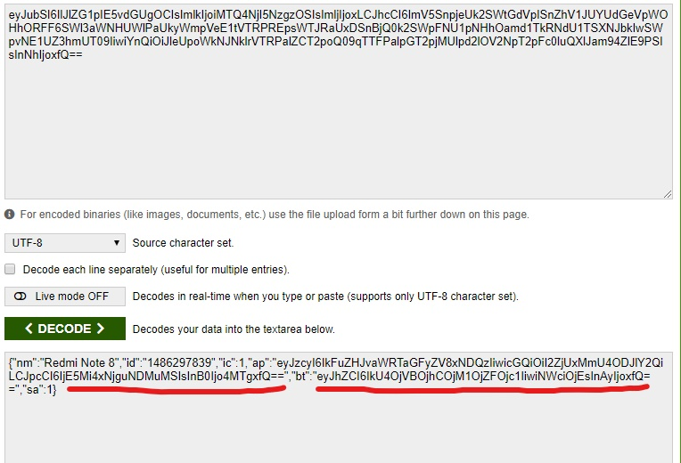
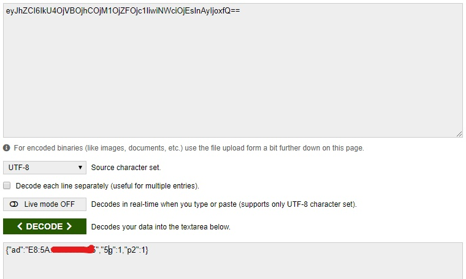
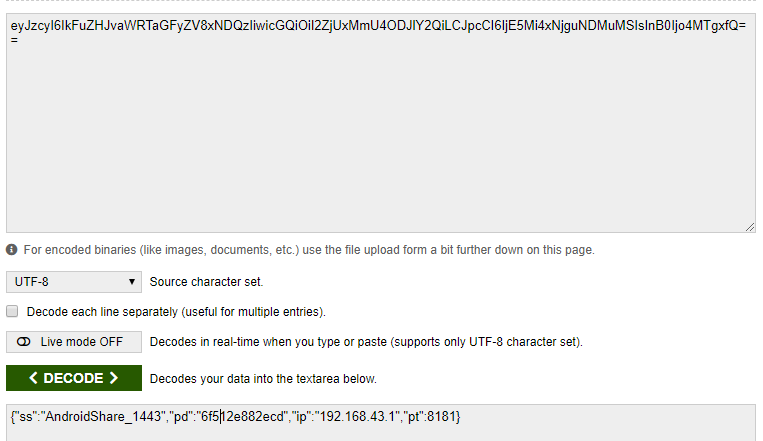

## Hi everyone ,

---

so recently I used [ShareMe](https://play.google.com/store/apps/details?id=com.xiaomi.midrop&hl=en) app to share some files with my friends, and there we have to read a QR code and it connects to send files.

so i was curious that what was in that QR code. it should be some information about the device so it can be recognized in the network.

---

---

To find out what is in it, I used a QR code scanner and decode it. and this is what I got.

---

---

hmmm, this looks like total gibberish but,
it could make some sense when we look in a different perspective.
is this could be a base64 encoded string.

Hmmmmmmmmmmmmmmm.....👀👀👀👀👀👀👀👀👀👀👀👀👀👀👀👀👀

so I used a base64 decoder to decode and look at what's inside. I mean this is trial and error, it may or may not be decoded but I tried it anyway, and this is the result.

---

---

here is a stringified JSON payload (i think🙄).

it decoded like a charm and it got the information about my phone model, some kind of a id and some codes that I don't understand and here also some gibberish so, what do we do to gibrish.. we put the to base 64 decodes ain't eh? 😁😁😁

well, it will not work always but this time it did.

---

---

here we can see some useful information such as my mac address and some flags I assume.

---

---

and in this payload, there goes my private IP address and I assume `8181` might be the port of this application.

so what can we get from this.well basically nothing important but staying curious will always lead us to find new problems so we can tackel with em.

---

---

I tried Whatsapp QR but it didn't give me any results worth sharing but if I found something new, yall will be the first to know.
   
Thanks for reading folks I'm out 🙌.

