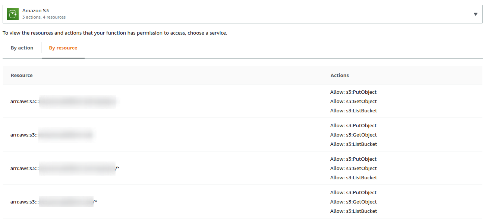
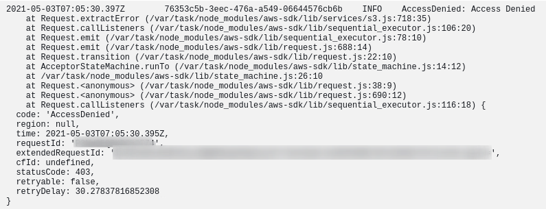
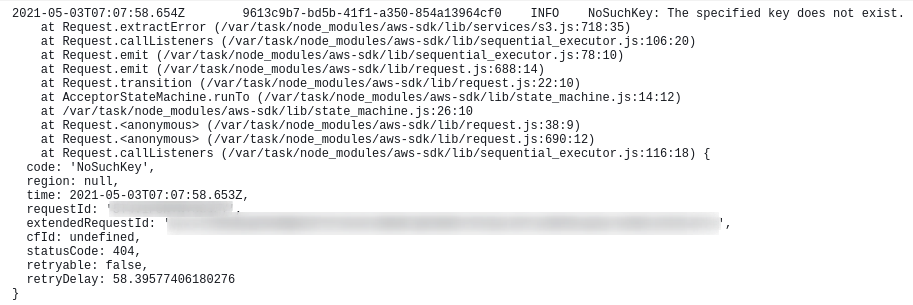
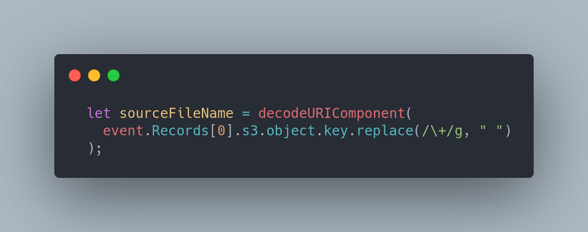

## Hi Everyone,

Hope you all are safe and sound.
 

So in this post, I'll walk through some of the mistakes I made developing an AWS lambda video transcoder and how I got through them.
the lambda function I developed will trigger on an s3 create object event and it will transcode a video using [FFmpeg](https://www.ffmpeg.org/) library and it will upload the transcoded video to another s3 bucket.i used serverless framework to ease the process and it really did . i combined it with github action to deploy to AWS.
at this point you might ask why don't you use aws [Elastic Transcoder](https://aws.amazon.com/elastictranscoder/) or AWS [Elemental MediaConvert](https://aws.amazon.com/mediaconvert/) . for start they are pricy and in the other hand i can get more knowledge and experience by doing it myself in lambda so i chose the hard way .

## 1 st mistake

s3 bucket and triggering lambda function both should be in the same region. this is well specified in most resources but I missed it.

 

## 2 nd mistake

 

I created and separate IAM roles to upload and get objects from the s3 buckets, and used that with AWS-SDK. this was the normal procedure, I've done it more than once so why bother, but turns out that was not essential, it will work but unnecessary because in AWS lambda you can specify the lambda Execution role
so that I can access other AWS resources without any credentials.

 

 

## 3 rd mistake

only giving get s3 object permission will give `403` `access denied` error if the specified key is not available in the bucket.

 

and because of this, I wasted time configuring IAM roles because I was confused that the lambda function didn't have permission to access the bucket but, in the end, it was my stupid mistake because the key I passed didn't exist, and guess what I didn't gave permission to list bucket , so AWS-SDK will return access denied error instead of no key found . after configuring correct permission I got no key found error. but why you would specify a key that doesn't exist huh, well next one explains that

 

 

## 4 th mistake

The next one is missing the decodeURIComponent on the s3 triggered event object key.because s3 object keys are URL encoded, I thought I pass
`Capone - OhNo(Lyrics).mp4` but actually what I passed was `Capone+-+OhNo%28Lyrics%29.mp4`. so I had to decode the key using `decodeURIComponent` and pass it .

  

  

And like that everything was coming together.
here is [github repo](https://github.com/RizkyRajitha/serverless-transcoder)

Thanks for reading so far. 
### Stay safe folks 🙌
